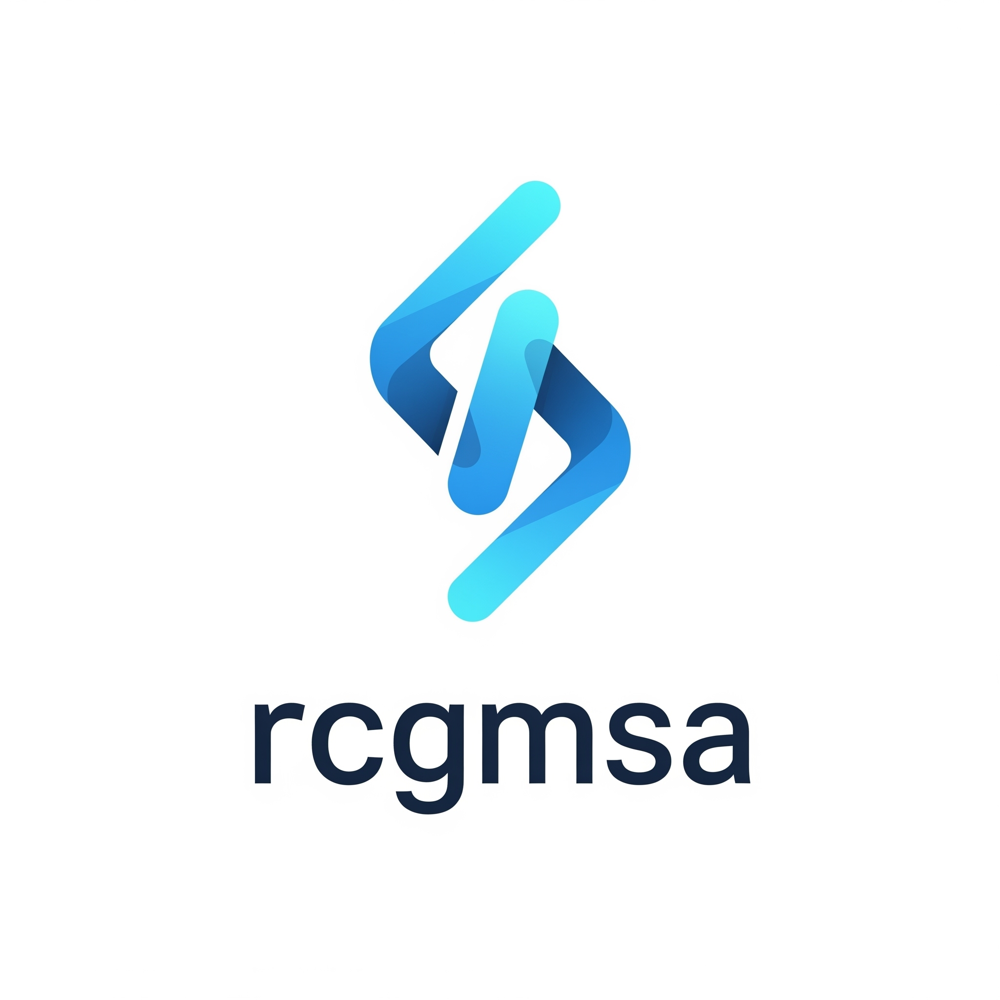

<a id="readme-top"></a>


<!-- PROJECT SHIELDS -->
<!--
*** I'm using markdown "reference style" links for readability.
*** Reference links are enclosed in brackets [ ] instead of parentheses ( ).
*** See the bottom of this document for the declaration of the reference variables
*** for contributors-url, forks-url, etc. This is an optional, concise syntax you may use.
*** https://www.markdownguide.org/basic-syntax/#reference-style-links
-->
[![Contributors][contributors-shield]][contributors-url]
[![Forks][forks-shield]][forks-url]
[![Stargazers][stars-shield]][stars-url]
[![Issues][issues-shield]][issues-url]
[![project_license][license-shield]][license-url]


<!-- PROJECT LOGO -->
<br />
<div align="center">
  <a href="https://github.com/byteskeptical/rcgmsa">
    
  </a>

<h3 align="center">rcgmsa</h3>

  <p align="center">
    Remote command execution with a healthy dose of detachment.
    <br />
    <a href="https://github.com/byteskeptical/rcgmsa"><strong>Explore the docs »</strong></a>
    <br />
    <br />
    <a href="https://github.com/byteskeptical/rcgmsa/issues/new?labels=bug">Report Bug</a>
    &middot;
    <a href="https://github.com/byteskeptical/rcgmsa/issues/new?labels=enhancement">Request Feature</a>
  </p>
</div>


<!-- TABLE OF CONTENTS -->
<details>
  <summary>Table of Contents</summary>
  <ol>
    <li>
      <a href="#about-the-project">About The Project</a>
      <ul>
        <li><a href="#built-with">Built With</a></li>
      </ul>
    </li>
    <li>
      <a href="#getting-started">Getting Started</a>
      <ul>
        <li><a href="#prerequisites">Prerequisites</a></li>
        <li><a href="#installation">Installation</a></li>
      </ul>
    </li>
    <li><a href="#usage">Usage</a></li>
    <li><a href="#roadmap">Roadmap</a></li>
    <li><a href="#contributing">Contributing</a></li>
    <li><a href="#license">License</a></li>
    <li><a href="#contact">Contact</a></li>
    <li><a href="#acknowledgments">Acknowledgments</a></li>
  </ol>
</details>


<!-- ABOUT THE PROJECT -->
## About The Project

Running processes as an unprivileged user can be tidious to setup. More so
if you have to worry about credentials that may be out of scope for the user
in use. Toil no longer, this script aims to simplify the setup process and
provide a standarized way to dynamically access sensitive bits by leveraging
Keeper's secrets manager functionality.

<p align="right">(<a href="#readme-top">back to top</a>)</p>


### Built With

* [![Powershell][powershell-shield]][powershell-url]

<p align="right">(<a href="#readme-top">back to top</a>)</p>


<!-- GETTING STARTED -->
## Getting Started

Keep in mind prerequisites only need to be done once per host. You don't need to
setup anything on the remote host(s) other than access by the user you want
to use. Vault configuration needs to be done per user, per host. Vault files are
technically portable as long as the same user SID is being used. This is something
to look into at some point.

### Prerequisites

First things first get yourself a newer copy of Powershell since Microsoft refuses
to provide you with one by default. If your fortunate enough to have winget
installed that is the preferred method. Any Windows Server < 2022 will not be
able to install winget due to unresolvable dependencies (trust me, I tried) and
will need to use the alternative below.

* powershell
  ```powershell
  winget install Powershell
  ```
  ```powershell
  $version = "7.6.0"
  Start-BitsTransfer -Source "https://github.com/PowerShell/PowerShell/releases/download/v${version}/PowerShell-${version}-win-x64.msi" -Destination "$env:USERPROFILE\Downloads\powershell.msi"
  msiexec.exe /package powershell.msi /quiet ADD_EXPLORER_CONTEXT_MENU_OPENPOWERSHELL=1 ADD_FILE_CONTEXT_MENU_RUNPOWERSHELL=1 ENABLE_PSREMOTING=1 REGISTER_MANIFEST=1 USE_MU=1 ENABLE_MU=1 ADD_PATH=1
  ```

Finally you'll need to grab yourself a copy of sysinternals. I hope to find a way to replace this with native functionality at some point but for now this is the simplest method to setup the user vault and Keeper connection as the GMSA user. The default filepath for user vaults is %LOCALAPPDATA%\Microsoft\PowerShell\secretmanagement.
  ```powershell
  Start-BitsTransfer -Source https://download.sysinternals.com/files/SysinternalsSuite.zip -Destination "$env:USERPROFILE\Downloads\SysinternalsSuite.zip"
  Expand-Archive -Path "$env:USERPROFILE\Downloads\SysinternalsSuite.zip" -DestinationPath "$env:USERPROFILE\Downloads\Sysinternals"
  ```

### Installation

1. Clone the repo
   ```sh
   git clone https://github.com/byteskeptical/rcgmsa.git
   ```
2. Run vault setup script (requires Powershell 6.0+) as the user you plan on using
   ```sh
   # opens a new powershell window, run the rest of the provided commands there
   $env:USERPROFILE\Downloads\Sysinternals\PsTools\PsExec.exe -p ~ -u domain\gMSAAccount$ pwsh.exe
   cd rcgmsa
   .\vault.ps1 -Path C:\temp\vault.xml -Vault devops

   # choose a password for vault when prompted
   PowerShell credential request
   Enter your credentials.
   Password for user devops: **************
   ```
3. Optionally copy the script to a required location for your use case
   ```sh
   cp rcgmsa.ps1 C:\{Your location}
   cd C:\{Your location}
   ```
4. Profit!
   ```sh
    .\rcgmsa.ps1 -Command script.ps1 -Computers 'windohs','gatesitches' -Domain GATESOFHELL -User bloatwarebillynaire$ -Keeper 7bn_cew-p2_alVUNmT09Tw -Vault devops
   ```

<p align="right">(<a href="#readme-top">back to top</a>)</p>


<!-- USAGE EXAMPLES -->
## Usage

Run single command or script locally as the unprivileged or service user.
   ```sh
    .\rcgmsa.ps1 -Command 'Get-WinEvent -LogName PowerShellCore/Operational' -Computers 'localhost' -User bloatwarebillynaire$
   ```

Run command or script on all machines listed in the contents of the microslop_machines.txt file as a user on a different domain.
   ```sh
    .\rcgmsa.ps1 -Command script.ps1 -Computers (Get-Content microslop_machines.txt) -Domain BILLSBUGS -User bloatwarebillynaire$
   ```

Run command or script on multiple machines passing additional credentials from a Keeper vault.
   ```sh
    .\rcgmsa.ps1 -Command script.ps1 -Computers 'gateskeepers','aibillonhill' -User bloatwarebillynaire$ -Keeper 7bn_cew-p2_alVUNmT09Tw -Vault developers
   ```

Run command or script on second hop jump host(s) (ip, fqdn, hostname) across multiple machines. Requires delegation to be enabled on domain along with GMSA user access to jump host(s).
   ```sh
    .\rcgmsa.ps1 -Command script.ps1 -Computers 'copilies','recallsins' -User bloatwarebillynaire$ -Orbs 'lilaintjames','microsoftness'
   ```

Putting it all together.
   ```sh
    .\rcgmsa.ps1 -Command important.ps1 -Computers (Get-Content app_servers.txt) -Domain GATESOFHELL -User bloatwarebillynaire$ -Keeper 7bn_cew-p2_alVUNmT09Tw -Orbs (Get-Content db_servers.txt) -Vault admins
   ```

Print current version.
   ```sh
    .\rcgmsa.ps1 -v
   ```

[![Product Name Screen Shot][product-screenshot]](https://github.com/byteskeptical/rcgmsa)

_Anywhere powershell is accepted and a few places it's not_

<p align="right">(<a href="#readme-top">back to top</a>)</p>


<!-- ROADMAP -->
## Roadmap

- [x] Handle GMSA authentication
- [x] Handle multiple machines at once
- [x] Handle second hop authentication
- [x] Keeper remote record access
    - [x] Keeper remote files field access
    - [ ] Portable vault files

See the [open issues](https://github.com/byteskeptical/rcgmsa/issues) for a full list of proposed features (and known issues).

<p align="right">(<a href="#readme-top">back to top</a>)</p>


<!-- CONTRIBUTING -->
## Contributing

Any contributions you make are **greatly appreciated**.

If you have a suggestion that would make this better, please fork the repo and
create a pull request. You can also simply open an issue with the tag "enhancement".
Don't forget to give the project a star! Thanks again!

1. Fork the Project
2. Create your Feature Branch (`git checkout -b feature/AmazingFeature`)
3. Commit your Changes (`git commit -m 'Add some AmazingFeature'`)
4. Push to the Branch (`git push origin feature/AmazingFeature`)
5. Open a Pull Request

<p align="right">(<a href="#readme-top">back to top</a>)</p>

### Top contributors:

<a href="https://github.com/byteskeptical/rcgmsa/graphs/root?ref_type=heads">
  
</a>


<!-- LICENSE -->
## License

Distributed under the project_license. See `LICENSE` for more information.

<p align="right">(<a href="#readme-top">back to top</a>)</p>


<!-- CONTACT -->
## Contact

byteskeptical - [@byteskeptical](https://github.com/byteskeptical) - bug@byteskeptical.com

Project Link: [https://github.com/byteskeptical/rcgmsa](https://github.com/byteskeptical/rcgmsa)

<p align="right">(<a href="#readme-top">back to top</a>)</p>


<!-- ACKNOWLEDGMENTS -->
## Acknowledgments

* [@byteskeptical](bug@byteskeptical.com)

<p align="right">(<a href="#readme-top">back to top</a>)</p>


<!-- MARKDOWN LINKS & IMAGES -->
[contributors-shield]: https://img.shields.io/github/contributors/byteskeptical/rcgmsa?style=white
[contributors-url]: https://github.com/byteskeptical/rcgmsa/graphs/contributors
[forks-shield]: https://img.shields.io/github/forks/byteskeptical/rcgmsa?style=white
[forks-url]: https://github.com/byteskeptical/rcgmsa/forks
[issues-shield]: https://img.shields.io/github/issues/byteskeptical/rcgmsa?style=white
[issues-url]: https://github.com/byteskeptical/rcgmsa/issues
[license-shield]: https://img.shields.io/github/license/byteskeptical/rcgmsa?style=white
[license-url]: https://github.com/byteskeptical/rcgmsa/blob/root/LICENSE
[powershell-shield]: https://img.shields.io/badge/PowerShell-003B57?style=flat&logo=gnome-terminal&logoColor=white
[powershell-url]: https://github.com/PowerShell/PowerShell
[product-screenshot]: https://raw.githubusercontent.com/PowerShell/PowerShell/master/assets/ps_black_64.svg?sanitize=true
[stars-shield]: https://img.shields.io/github/stars/byteskeptical/rcgmsa?style=white
[stars-url]: https://github.com/byteskeptical/rcgmsa/stargazers
